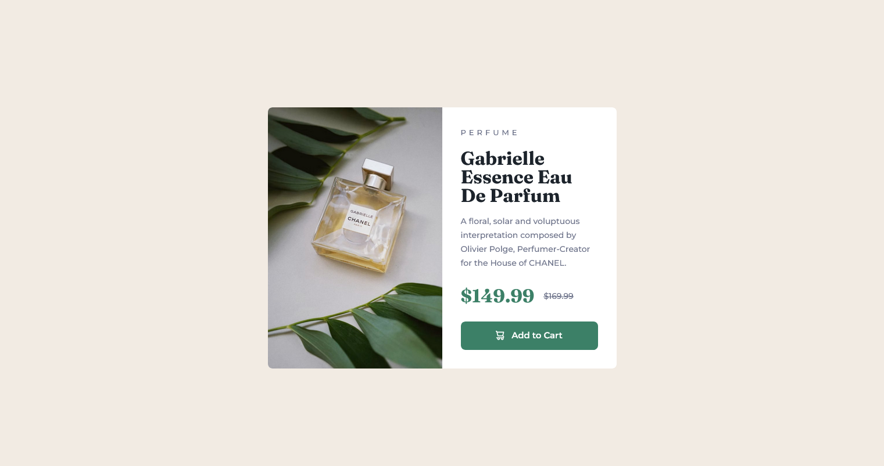

# Frontend Mentor - Product preview card component solution

This is a solution to the [Product preview card component challenge on Frontend Mentor](https://www.frontendmentor.io/challenges/product-preview-card-component-GO7UmttRfa). Frontend Mentor challenges help you improve your coding skills by building realistic projects.

## Table of contents

- [Overview](#overview)
  - [The challenge](#the-challenge)
  - [Screenshot](#screenshot)
  - [Links](#links)
- [My process](#my-process)
  - [Built with](#built-with)
  - [What I learned](#what-i-learned)

## Overview

### The challenge

Users should be able to:

- View the optimal layout depending on their device's screen size
- See hover and focus states for interactive elements

### Screenshot

### Links

- Live Site URL: [Add live site URL here](https://your-live-site-url.com)

## My process

### Built with

- Semantic HTML5 markup
- CSS custom properties
- Flexbox
- CSS Grid
- Mobile-first workflow

### What I learned

Today I completed the **Product Preview Card Component** challenge from Frontend Mentor. 🛍️ I started by trying on my own, but my code was messy and unorganized. After watching Kevin Powell’s tutorial, I learned how to structure my HTML & CSS systematically. His approach really helped me think clearly!

✨ **What I learned today:**

- ✅ How to use `[data-icon="shopping-cart"]` for flexible button icons
- ✅ `display: inline-flex` for perfect alignment inside buttons
- ✅ Responsive images with `<source srcset="">` for better UX on different devices
- ✅ `flex-wrap` to make flex items adapt nicely on smaller screens

💪 **My biggest struggle today** was understanding how to combine semantic HTML with responsive design. It took me a while to make the layout work well on both mobile and desktop. But I’m proud of the final result!
